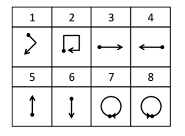

# 1.Introduction

[This](http://www.ruf.rice.edu/~mobile/publications/liu09percom.pdf)  conference paper by  Liu et al. (2009) states that recently, gestures became more attractive for (in the context of pervasive computing) "spontaneous" interactions with consumer electronics, and also with mobile devices. By using a single three-axis accelerometer to collect data (from 8 users in total) to characterize eight gesture patterns. 
The library, uWaveGestureLibrary, that used in this assignment consists over 4000 instances which has, each one, the accelerometer readings in 3-dimensions; x,y, and z. Eight gestures ares:



```{r setup, include=FALSE}
knitr::opts_chunk$set(echo = TRUE)
```

# 2.Libraries

These libraries basicly used for mainly data aggregation (meaning more flexible and easy data handling) and plotting purposes, they will be covered throught this assignment.

```{r libraries, message=FALSE, warning=FALSE}

library(data.table)
library(tidyverse)
library(dplyr)
library(reshape)
library(scatterplot3d)
library(plotly)

```

# 3.Importing Data

uWaveGestureLibrary data set is provided by Bogazici University IE 582 Course and can accessible from [my GitHub page - HW2 File directory](https://github.com/BU-IE-582/fall20-kaanblgn). Since files have file extension, fread function used to import the train sets. All set can be downloadable one by one or within a zip file, both choice is provided in [GitHub page](https://github.com/BU-IE-582/fall20-kaanblgn). Make sure you are adressing the right folder where the train sets are downloaded when you compile the codes. I could use my GitHub folder adress as well for importing features but the time consumption for compiling that code is not as pragmatic as the classic way.  

```{r import data}

# a denotes for acceleration while X,Y and Z are train set names (a_X == acceleration data for X data set and vice versa)

a_x = fread("C:/Users/Kaan/Documents/GitHub/fall20-kaanblgn/files/HW2/uWaveGestureLibrary_X_TRAIN")
a_y = fread("C:/Users/Kaan/Documents/GitHub/fall20-kaanblgn/files/HW2/uWaveGestureLibrary_Y_TRAIN")
a_z = fread("C:/Users/Kaan/Documents/GitHub/fall20-kaanblgn/files/HW2/uWaveGestureLibrary_Z_TRAIN")

```

# 4. Tasks

## 4.1.Task A: Visualization of Every Class In Dataset

Before starting the visualization of the train sets, let's have a look at the data tables imported. As you can see that first columns acting as an identifier, for the rest of the report, first column will be referred as Class for each X,Y, and Z train set data. Each train set(x,y, and z) filtered through their class features. After filtering process done, we need to think how to visualize this problem. This datasets are generated by an accelerometer, meaning each observation is an acceleration recording for a given recording frequency. But there is a problem here, we try to visualize the data in order to make them look like hand gestures that specified above. So the gestures are positions and are all in same space (space and time domain) with acceleration with one small difference, remembering that acceleration vector is nothing different but the second derivative of the position vector respect to time. So in order to visualize the position recording of the dataset, we need the transform the acceleration data to position data. Recalling again the second derivative information, we can apply integration over time twice to get position. Which we can summarize this as acceleration --> velocity --> position. This integration can be done by the cumulative sum of acceleration over time, then same process again with the cumulative sum of velocity over time. 

```{r change column names}

#First Column names changed from V1 to Class

colnames(a_x)[1]<-"Class"
colnames(a_y)[1]<-"Class"
colnames(a_z)[1]<-"Class"
```

Class 1:
```{r Class 1, warning=FALSE}

# Filtering the data set by the class number, c denotes class where 1 denotes first class (c_1 == class 1). This also applies for the rest of the classes that will be plotted also one after another.

c_1 <- as.data.frame(cbind(x = t(filter(a_x, Class == 1))[,1],
                           y = t(filter(a_y, Class == 1))[,1],
                           z = t(filter(a_z, Class == 1))[,1]))

# Calculating velocity data by taking cumulative sum of the class filtered acceleration data. v denotes velocity (v_x == velocity data of x and vice versa).

c_1 <- data.frame(c_1, v_x = cumsum(c_1$x),
                       v_y = cumsum(c_1$y),
                       v_z = cumsum(c_1$z))

# Calculating position data by taking cumulative sum of the class filtered velocity data. p denotes position (p_x == velocity data of x and vice versa).

c_1 <- data.frame(c_1, p_x=cumsum(c_1$v_x),
                       p_y=cumsum(c_1$v_y),
                       p_z=cumsum(c_1$v_z))

rownames(c_1) <- 1:nrow(c_1)

c_1$row<-as.numeric(rownames(c_1))/nrow(c_1)

#Color-Blind friendly colors have been selected for the plot 

Class_1 <- plot_ly(c_1, 
              x = ~p_x, 
              y = ~p_y, 
              z = ~p_z, 
              color = ~row, 
              colors = c('Blue', 'Grey'))

Class_1 <- Class_1 %>% add_markers()

Class_1 <- Class_1 %>% layout(scene = list(xaxis = list(title = 'x'),
                                           yaxis = list(title = 'y'),
                                           zaxis = list(title = 'z')))
Class_1
```

Class 2:
```{r Class 2, warning=FALSE}

# Again, same process at class 1 for this class

c_2 <- as.data.frame(cbind(x = t(filter(a_x, Class == 2))[,1],
                           y = t(filter(a_y, Class == 2))[,1],
                           z = t(filter(a_z, Class == 2))[,1]))

c_2 <- data.frame(c_2, v_x = cumsum(c_2$x),
                       v_y = cumsum(c_2$y),
                       v_z = cumsum(c_2$z))

c_2 <- data.frame(c_2, p_x=cumsum(c_2$v_x),
                       p_y=cumsum(c_2$v_y),
                       p_z=cumsum(c_2$v_z))

rownames(c_2) <- 1:nrow(c_2)

c_2$row<-as.numeric(rownames(c_2))/nrow(c_2)

#Color-Blind friendly colors have been selected for the plot 

Class_2 <- plot_ly(c_2, 
              x = ~p_x, 
              y = ~p_y, 
              z = ~p_z, 
              color = ~row, 
              colors = c('Blue', 'Grey'))

Class_2 <- Class_2 %>% add_markers()

Class_2 <- Class_2 %>% layout(scene = list(xaxis = list(title = 'x'),
                                           yaxis = list(title = 'y'),
                                           zaxis = list(title = 'z')))
Class_2
```

Class 3:
```{r Class 3, warning=FALSE}

# Again, same process at class 1 for this class

c_3 <- as.data.frame(cbind(x = t(filter(a_x, Class == 3))[,1],
                           y = t(filter(a_y, Class == 3))[,1],
                           z = t(filter(a_z, Class == 3))[,1]))

c_3 <- data.frame(c_3, v_x = cumsum(c_3$x),
                       v_y = cumsum(c_3$y),
                       v_z = cumsum(c_3$z))

c_3 <- data.frame(c_3, p_x=cumsum(c_3$v_x),
                       p_y=cumsum(c_3$v_y),
                       p_z=cumsum(c_3$v_z))

rownames(c_3) <- 1:nrow(c_3)

c_3$row<-as.numeric(rownames(c_3))/nrow(c_3)

#Color-Blind friendly colors have been selected for the plot 

Class_3 <- plot_ly(c_3, 
              x = ~p_x, 
              y = ~p_y, 
              z = ~p_z, 
              color = ~row, 
              colors = c('Blue', 'Grey'))

Class_3 <- Class_3 %>% add_markers()

Class_3 <- Class_3 %>% layout(scene = list(xaxis = list(title = 'x'),
                                           yaxis = list(title = 'y'),
                                           zaxis = list(title = 'z')))
Class_3
```

Class 4:
```{r Class 4, warning=FALSE}

# Again, same process at class 1 for this class

c_4 <- as.data.frame(cbind(x = t(filter(a_x, Class == 4))[,1],
                           y = t(filter(a_y, Class == 4))[,1],
                           z = t(filter(a_z, Class == 4))[,1]))

c_4 <- data.frame(c_4, v_x = cumsum(c_4$x),
                       v_y = cumsum(c_4$y),
                       v_z = cumsum(c_4$z))

c_4 <- data.frame(c_4, p_x=cumsum(c_4$v_x),
                       p_y=cumsum(c_4$v_y),
                       p_z=cumsum(c_4$v_z))

rownames(c_4) <- 1:nrow(c_4)

c_4$row<-as.numeric(rownames(c_4))/nrow(c_4)

#Color-Blind friendly colors have been selected for the plot 

Class_4 <- plot_ly(c_4, 
              x = ~p_x, 
              y = ~p_y, 
              z = ~p_z, 
              color = ~row, 
              colors = c('Blue', 'Grey'))

Class_4 <- Class_4 %>% add_markers()

Class_4 <- Class_4 %>% layout(scene = list(xaxis = list(title = 'x'),
                                           yaxis = list(title = 'y'),
                                           zaxis = list(title = 'z')))
Class_4
```

Class 5:
```{r Class 5, warning=FALSE}

# Again, same process at class 1 for this class

c_5 <- as.data.frame(cbind(x = t(filter(a_x, Class == 5))[,1],
                           y = t(filter(a_y, Class == 5))[,1],
                           z = t(filter(a_z, Class == 5))[,1]))

c_5 <- data.frame(c_5, v_x = cumsum(c_5$x),
                       v_y = cumsum(c_5$y),
                       v_z = cumsum(c_5$z))

c_5 <- data.frame(c_5, p_x=cumsum(c_5$v_x),
                       p_y=cumsum(c_5$v_y),
                       p_z=cumsum(c_5$v_z))

rownames(c_5) <- 1:nrow(c_5)

c_5$row<-as.numeric(rownames(c_5))/nrow(c_5)

#Color-Blind friendly colors have been selected for the plot 

Class_5 <- plot_ly(c_5, 
              x = ~p_x, 
              y = ~p_y, 
              z = ~p_z, 
              color = ~row, 
              colors = c('Blue', 'Grey'))

Class_5 <- Class_5 %>% add_markers()

Class_5 <- Class_5 %>% layout(scene = list(xaxis = list(title = 'x'),
                                           yaxis = list(title = 'y'),
                                           zaxis = list(title = 'z')))
Class_5
```

Class 6:
```{r Class 6, warning=FALSE}

# Again, same process at class 1 for this class

c_6 <- as.data.frame(cbind(x = t(filter(a_x, Class == 6))[,1],
                           y = t(filter(a_y, Class == 6))[,1],
                           z = t(filter(a_z, Class == 6))[,1]))

c_6 <- data.frame(c_6, v_x = cumsum(c_6$x),
                       v_y = cumsum(c_6$y),
                       v_z = cumsum(c_6$z))

c_6 <- data.frame(c_6, p_x=cumsum(c_6$v_x),
                       p_y=cumsum(c_6$v_y),
                       p_z=cumsum(c_6$v_z))

rownames(c_6) <- 1:nrow(c_6)

c_6$row<-as.numeric(rownames(c_6))/nrow(c_6)

#Color-Blind friendly colors have been selected for the plot 

Class_6 <- plot_ly(c_6, 
              x = ~p_x, 
              y = ~p_y, 
              z = ~p_z, 
              color = ~row, 
              colors = c('Blue', 'Grey'))

Class_6 <- Class_6 %>% add_markers()

Class_6 <- Class_6 %>% layout(scene = list(xaxis = list(title = 'x'),
                                           yaxis = list(title = 'y'),
                                           zaxis = list(title = 'z')))
Class_6
```

Class 7:
```{r Class 7, warning=FALSE}

# Again, same process at class 1 for this class

c_7 <- as.data.frame(cbind(x = t(filter(a_x, Class == 7))[,1],
                           y = t(filter(a_y, Class == 7))[,1],
                           z = t(filter(a_z, Class == 7))[,1]))

c_7 <- data.frame(c_7, v_x = cumsum(c_7$x),
                       v_y = cumsum(c_7$y),
                       v_z = cumsum(c_7$z))

c_7 <- data.frame(c_7, p_x=cumsum(c_7$v_x),
                       p_y=cumsum(c_7$v_y),
                       p_z=cumsum(c_7$v_z))

rownames(c_7) <- 1:nrow(c_7)

c_7$row<-as.numeric(rownames(c_7))/nrow(c_7)

#Color-Blind friendly colors have been selected for the plot 

Class_7 <- plot_ly(c_7, 
              x = ~p_x, 
              y = ~p_y, 
              z = ~p_z, 
              color = ~row, 
              colors = c('Blue', 'Grey'))

Class_7 <- Class_7 %>% add_markers()

Class_7 <- Class_7 %>% layout(scene = list(xaxis = list(title = 'x'),
                                           yaxis = list(title = 'y'),
                                           zaxis = list(title = 'z')))
Class_7
```

Class 8:
```{r Class 8, warning=FALSE}

# Again, same process at class 1 for this class

c_8 <- as.data.frame(cbind(x = t(filter(a_x, Class == 8))[,1],
                           y = t(filter(a_y, Class == 8))[,1],
                           z = t(filter(a_z, Class == 8))[,1]))

c_8 <- data.frame(c_8, v_x = cumsum(c_8$x),
                       v_y = cumsum(c_8$y),
                       v_z = cumsum(c_8$z))

c_8 <- data.frame(c_8, p_x=cumsum(c_8$v_x),
                       p_y=cumsum(c_8$v_y),
                       p_z=cumsum(c_8$v_z))

rownames(c_8) <- 1:nrow(c_8)

c_8$row<-as.numeric(rownames(c_8))/nrow(c_8)

#Color-Blind friendly colors have been selected for the plot 

Class_8 <- plot_ly(c_8, 
              x = ~p_x, 
              y = ~p_y, 
              z = ~p_z, 
              color = ~row, 
              colors = c('Blue', 'Grey'))

Class_8 <- Class_8 %>% add_markers()

Class_8 <- Class_8 %>% layout(scene = list(xaxis = list(title = 'x'),
                                           yaxis = list(title = 'y'),
                                           zaxis = list(title = 'z')))
Class_8
```

## 4.2.Task B: Dimensionality Reduction 

Provided acceleration data, which is a regular data matrix, is a multivariate time series case since it has 3 dimensions. Task is, taking this multivariate time series data and transform it to a univariate (1 dimension or 1-D) data case. One way is applying a principle component analysis (or PCA shortly). What PCA do is that it simply finds a basis for all of the 3 dimensions to represent them as 1D without losing much information. In order to achieve this we need to make some transformations to data, make it in "long" format (This block is mainly based on [this](https://stackoverflow.com/questions/3777174/plotting-two-variables-as-lines-using-ggplot2-on-the-same-graph/3777592#3777592) code). Before PCA we also need to add a series ID for each data set, which acting as an indicator or shortly as an ID number.

```{r long formatting and pca reporting, message = TRUE, warning = FALSE, cache = TRUE}

# PCA with using whole data

# Adding Time_Series_ID columns for each data set 

a_x$Time_Series_ID <- c(1:896)
a_y$Time_Series_ID <- c(1:896)
a_z$Time_Series_ID <- c(1:896)

x_melt <- melt(a_x, id = c("Time_Series_ID", "Class"))
y_melt <- melt(a_y, id = c("Time_Series_ID", "Class"))
z_melt <- melt(a_z, id = c("Time_Series_ID", "Class"))

# Combining long converted data sets

long_data <- data.frame(Time_Series_ID = x_melt$Time_Series_ID,
                        Class    = x_melt$Class, 
                        Variable = x_melt$variable,
                        X = x_melt$value, 
                        Y = y_melt$value,
                        Z = z_melt$value)

long_data <- long_data[order(long_data$Time_Series_ID), ]

colnames(long_data)[3] <- "Time_Index"

long_data$Time_Index <- rep(1:315, 896)

# Reporting and re-adjusting after applying the Principal Component Analysis between 4th and 6th column. 4th-6th because if you can look the long_data, these are X,Y and Z components.

long_data_pca =  princomp(long_data[, 4:6])

summary(long_data_pca, loadings = T)

pca_data <- data.frame(Time_Series_ID = long_data$Time_Series_ID,
                       Class = long_data$Class, 
                       Time_Index = long_data$Time_Index,
                       PCA = long_data_pca$scores[,1])


```

- First composition explained variance with 0.49 
- Second composition explained variance with 0.3467
- And lastly, third composition explained variance with 0.1627

Sum of these compositions gives %100 of the variance while the highest variance covering is the first composition. Linear combination of the compositions can also seen at the "Loadings" table, which can be read like comp1 = 0.427X + 0.721Y + 0.546Z

### 4.2.1.PCA Visualization Inspection

To visualize inspection of the PCA applied data, code will select two random time series from each class and will plot pca applied data to see if classes can be seperated in the reduced dimensions.

```{r Class Based Pca, message = FALSE, warning = FALSE, cache = TRUE}

# Class 1
class_1_pca <- data.frame(Time_Index = c(1:315), 
                         a_10 = pca_data$PCA[long_data$Time_Series_ID  == 10],
                         a_27 = pca_data$PCA[long_data$Time_Series_ID  == 27])

c_1_pca <- ggplot(class_1_pca) +
           geom_line(aes(x = Time_Index, y = a_10), color = "Blue") +
           geom_line(aes(x = Time_Index, y = a_27), color = "Gray") +
           ylab("Value") +
           ggtitle("Time Series from Class 1")

c_1_pca <- ggplotly(c_1_pca)

c_1_pca

# Class 2

class_2_pca <- data.frame(Time_Index = c(1:315), 
                          a_51 = pca_data$PCA[long_data$Time_Series_ID == 51],
                          a_28 = pca_data$PCA[long_data$Time_Series_ID == 28])

c_2_pca <- ggplot(class_2_pca) +
           geom_line(aes(x = Time_Index, y = a_51), color = "Blue") +
           geom_line(aes(x = Time_Index, y = a_28), color = "Gray") +
           ylab("Value")+
           ggtitle("Time Series from Class 2")

c_2_pca <- ggplotly(c_2_pca)

c_2_pca

# Class 3

class_3_pca <- data.frame(Time_Index = c(1:315), 
                          a_48 = pca_data$PCA[long_data$Time_Series_ID == 48],
                          a_23 = pca_data$PCA[long_data$Time_Series_ID == 23])

c_3_pca <- ggplot(class_3_pca) +
           geom_line(aes(x = Time_Index, y = a_48), color = "Blue") +
           geom_line(aes(x = Time_Index, y = a_23), color = "Gray") +
           ylab("Value")+
           ggtitle("Time Series from Class 3")

c_3_pca <- ggplotly(c_3_pca)

c_3_pca

## Class 4

class_4_pca <- data.frame(Time_Index = c(1:315), 
                          a_17 = pca_data$PCA[long_data$Time_Series_ID == 17],
                          a_47 = pca_data$PCA[long_data$Time_Series_ID == 47])

c_4_pca <- ggplot(class_4_pca) +
           geom_line(aes(x = Time_Index, y = a_17), color = "Blue") +
           geom_line(aes(x = Time_Index, y = a_47), color = "Gray") +
           ylab("Value")+
           ggtitle("Time Series from Class 4")

c_4_pca <- ggplotly(c_4_pca)

c_4_pca

# Class 5

class_5_pca <- data.frame(Time_Index = c(1:315), 
                          a_60 = pca_data$PCA[long_data$Time_Series_ID == 60],
                          a_9  = pca_data$PCA[long_data$Time_Series_ID ==  9])

c_5_pca <- ggplot(class_5_pca) +
           geom_line(aes(x = Time_Index, y = a_60), color = "Blue") +
           geom_line(aes(x = Time_Index, y = a_9), color = "Gray") +
           ylab("Value")+
           ggtitle("Time Series from Class 5")

c_5_pca <- ggplotly(c_5_pca)

c_5_pca

# Class 6

class_6_pca <- data.frame(Time_Index = c(1:315), 
                          a_46 = pca_data$PCA[long_data$Time_Series_ID == 46],
                          a_26 = pca_data$PCA[long_data$Time_Series_ID == 26])

c_6_pca <- ggplot(class_6_pca) +
           geom_line(aes(x = Time_Index, y = a_46), color = "Blue") +
           geom_line(aes(x = Time_Index, y = a_26), color = "Gray") +
           ylab("Value")+
           ggtitle("Time Series from Class 6")

c_6_pca <- ggplotly(c_6_pca)

c_6_pca

# Class 7

class_7_pca <- data.frame(Time_Index = c(1:315), 
                          a_34 = pca_data$PCA[long_data$Time_Series_ID == 34],
                          a_15 = pca_data$PCA[long_data$Time_Series_ID == 15])

c_7_pca <- ggplot(class_7_pca) +
           geom_line(aes(x = Time_Index, y = a_34), color = "Blue") +
           geom_line(aes(x = Time_Index, y = a_15), color = "Gray") +
           ylab("Value")+
           ggtitle("Time Series from Class 7") 

c_7_pca <- ggplotly(c_7_pca)

c_7_pca

# Class 8

class_8_pca <- data.frame(Time_Index = c(1:315), 
                          a_37 = pca_data$PCA[long_data$Time_Series_ID == 37],
                          a_57 = pca_data$PCA[long_data$Time_Series_ID == 57])

c_8_pca <- ggplot(class_8_pca) +
           geom_line(aes(x = Time_Index, y = a_37), color = "Blue") +
           geom_line(aes(x = Time_Index, y = a_57), color = "Gray") +
           ylab("Value")+
           ggtitle("Time Series from Class 8")

c_8_pca <- ggplotly(c_8_pca)

c_8_pca
```

### 4.2.2.Results and Discussion 

When looking out to the output plots, they sometimes look similar (for each class in itself I mean), but sometimes looks very opposite.


## 4.3.Task C: class Based PCA and Comparison

Long formatted data splitted for each Class number in order to start class based PCA. Then PCA applied to splitted data and summary reported for the each class. Additional commments are below.

```{r Class Based PCA, message = TRUE, warning = FALSE, cache = TRUE}

split_data <- split(long_data, long_data$Class)

split_data_pca <- map(split_data, ~princomp(.[,4:6]))

map(split_data_pca, summary, loadings = T)

```

### Results and Discussion

With maximum of 64.7% variance explained, for all classes, except class 1, variance explained by the first composition exceeded Whole model data PCA results' variance explained by the first composition which were 49%.


## 4.4.Task D: Visualizing the Dimension Reduced Time Data Series

Multi dimensional scaling applied to the distance matrix. Euclidean distance matrix used.


```{r manhattan distance visualize-mds}
# Finding Distances for all x,y and Z. d_x denotes for distance for x matrix.

d_x <- as.matrix(dist(a_x[, 2:316], 
                         method = "euclidean",  
                         diag = FALSE,
                         upper = FALSE))

d_y <- as.matrix(dist(a_y[, 2:316], 
                         method = "euclidean",  
                         diag = FALSE, 
                         upper = FALSE))

d_z <- as.matrix(dist(a_z[, 2:316], 
                         method = "euclidean", 
                         diag = FALSE, 
                         upper = FALSE))

# Combining x,y and z distances

d_all <- (d_x + d_y + d_z)

# Scaling the matrix 

d_cmdscale <- cmdscale(d_all, k = 2)

# Adding Class Information

d_cmdscale <- data.table(unlist(apply(a_x[, 1], 2, as.character)), 
                         distance_1 = d_cmdscale[,1],
                         distance_2 = d_cmdscale[,2])

# Plot
ggplot(d_cmdscale, 
       aes(x = distance_1, 
           y = distance_2, 
           color = Class)) +
geom_point() +
labs(title = "MDS Results",
     x = "First Coordinate",
     y = "Second Coordinate")
```

### 4.5.Visualazing the Dimension Reduced Time Data Series

Even tough some classes(gestures in a sense) can be seperable by looking at it, it is neither practical nor a secure way to classify it. 


Press [here](https://bu-ie-582.github.io/fall20-kaanblgn/) to return to homepage.

